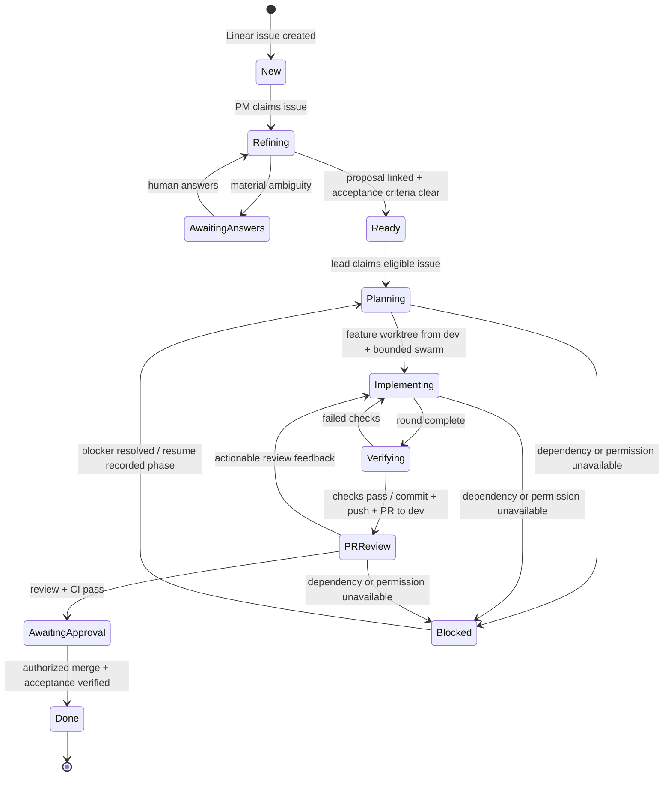

# Orca automation workspace

Status: three approved Tribal Cities role automations registered, disabled, with fail-closed prechecks. Orca repo and controller worktree registered locally; controller opened in Herdr. No agents launched, Linear writes, pushes or PRs performed.

## Tribal Cities setup and ownership

- Repo: `/home/nyaptor/dev/priceless/tribal-cities`; base branch: `dev`; organization intent: Priceless.
- Definitions: `config/tribal-cities.json`. Validate with `pnpm orca:validate`; load/update with `pnpm orca:install`. Reload preserves matching automation IDs and always disables them.
- Existing controller: `/home/nyaptor/orca/workspaces/tribal-cities/tribal-cities-automation-control`. Reuse this workspace for scheduled role prompts to avoid a new checkout every hour. The shared controller is read-only for role agents; actual proposal/feature/review edits happen in separate issue-specific worktrees based on `dev`.
- Herdr workspace: `w9K`, label `Tribal Cities · automations`. Opening the same worktree again reuses its existing workspace.
- Orca currently returns no Linear teams or projects. Team/project/state IDs remain null. Every definition has `--precheck "exit 1"` in addition to being disabled; even manual runs should skip until the precheck is intentionally replaced. No live workflow claim is made.

### Orca creates; Herdr opens

Verified locally: `orca-ide worktree create` creates the Git worktree under `~/orca/workspaces/tribal-cities/`; `herdr worktree open` opens that existing checkout as a project-linked workspace. Do not use `herdr worktree create` for Orca-owned work. Herdr workspace grouping is metadata, not a second checkout location. No arbitrary checkout-path flag is exposed by the installed Orca creation command.

Inside a legitimate Herdr pane, open any existing Tribal Cities checkout:

```sh
pnpm orca:open /absolute/orca/worktree/path --label "Tribal Cities · issue"
```

The bridge verifies the Git common directory, never creates/removes a checkout, never changes focus, and refuses to operate outside Herdr. Orca retains lifecycle ownership; never remove these worktrees through Herdr. Keep Orca-supervised worker terminals in Orca; a Herdr shell opened on the same checkout does not own or supervise those terminals.

Unattended Orca automation terminals are not proven to belong to a Herdr session. Do not set `HERDR_ENV=1` to fake that boundary. They can create Orca worktrees and record returned paths; invoke the bridge from a real Herdr pane. Automatic unattended Herdr projection remains a separate integration requirement, not a verified feature.

`~` is suitable as a Herdr shell cwd (`herdr workspace create --cwd /home/nyaptor --label "Automations" --no-focus`), but a home folder is not a Git worktree. Keep definitions in `~/dev/personal/agents`, use the existing project controller for scheduling, and create project worktrees for edits. Do not register all of home or expose its secrets as an automation repo.

Before enabling: connect the Priceless Linear account in Orca, resolve the exact team/project and workflow state IDs, verify Claude/Codex availability, replace fail-closed prechecks with read-only eligibility checks, and implement/test exclusive per-role claims. Linear status changes alone are not atomic locks. Enabled schedules can overlap; prompt instructions alone do not prove mutual exclusion.

Verified against installed Orca 1.4.176 on 2026-10-03. On this Linux host use `orca-ide`, not bare `orca` (the screen reader).

## Recommended design

Three disabled, scheduled automations per approved repo: PM refinement, lead-dev delivery, independent PR review. Linear is the task source of truth; OpenSpec is the requirements source of truth; Git/PRs carry delivery evidence. Orca owns worktrees, agent terminals, and orchestration.

Alternatives:

- One automation for everything: fewer definitions, but mixes roles and makes duplicate claims/recovery harder.
- Three scheduled role prompts (recommended): supported today, independently testable, no webhook service needed.
- Webhook-driven controller: lower latency, but requires an external receiver, authenticated events, deduplication, and delivery retries. Defer until polling works.

## Proposed state machine

Labels below are logical states, not assumed Linear status names. Map them to each team's actual states before loading.



ASCII twin:

```text
New -> Refining <-> AwaitingAnswers -> Ready
                                      |
                                   Planning
                                      |
                                 Implementing <---+
                                      |          |
                                  Verifying -----+ (failed checks)
                                      |
                                   PRReview -----+ (changes requested)
                                      |
                               AwaitingApproval
                                      |
                                     Done
Active phase -> Blocked -> recorded phase after resolution
```

### PM refinement

1. Select a new eligible issue in the configured Linear team/project; inspect existing claims, links, and OpenSpec artifacts before creating anything.
2. Refine intent, scope, constraints, dependencies, and observable acceptance criteria. Ask only material questions; record them on the issue and wait for answers rather than guessing.
3. Author/update a stable `openspec/changes/<change-id>/` proposal on the project's dev branch through a dedicated Orca worktree. Never change a dirty/shared checkout. Follow repo policy and validate OpenSpec artifacts before committing.
4. Include the Linear identifier in the proposal; link the stable change ID and repository path back to the issue. Attach a resolvable source URL only after the approved push makes it available.
5. Re-run refinement on new answers. Move to the mapped Ready state only when ambiguities and blocking dependencies are resolved and acceptance criteria are testable. Product/access/destructive decisions remain human-owned.

### Lead-dev delivery

1. Pull an eligible Ready issue in dependency/priority order. Record ownership before dispatch; re-check ownership and existing worktrees/PRs to avoid duplicates. Do not assume Linear status updates are atomic locks. Initially permit one lead run per repo; concurrent workers need an actual exclusive claim mechanism.
2. Read the linked proposal from dev, create an issue-linked feature worktree from that base, create the implementation plan, dispatch bounded Orca workers. Use separate child worktrees for concurrent edits; integrate worker commits deliberately.
3. At each round: collect results, integrate, run relevant checks, commit only verified changes. Failed checks return to implementation; blocked rounds retain evidence and a resume point.
4. Once the scoped feature is ready, push its feature branch and create/update one PR targeting dev. Link the PR and check evidence to Linear. Never push incomplete work directly to dev.
5. Preserve existing attribution and unrelated changes. Do not merge or mark Done merely because a PR exists.

### Independent review

1. Inspect open issue-linked PRs and CI results. Skip unchanged PR head revisions already reviewed.
2. Review requirements, correctness, security, scope, integration boundaries, and verification evidence independently of the implementation worker.
3. Record findings against the exact PR head revision. Changes requested return to delivery; passing review plus CI waits for authorized merge.
4. Verify the final merged outcome before completing the Linear item. Keep merge authority explicit.

## CLI capabilities verified locally

| Area | Available | Boundary |
| --- | --- | --- |
| Automations | `automations list/show/create/edit/remove/run/runs`; schedules, prechecks, repo/workspace target, base branch, disabled creation | Scheduled agent prompts, not a general webhook server or transactional workflow engine |
| Repos | `repo list/add/show/set-base-ref/search-refs` | Repo registration is separate from changing Git remotes or branch protection |
| Worktrees | `worktree list/show/current/create/set/rm/ps`; `--base-branch`, `--linear-issue`, parent worktrees | Removal is destructive; do not automate cleanup until approved |
| Agents | `terminal list/show/read/send/wait/stop`; supervised `orchestration worker-*` | Provider/account availability must be checked before loading |
| Swarm coordination | `orchestration task-create/task-list/task-update/dispatch`, messaging, decision gates | Requires explicit task ownership and integrated verification |
| Linear | `linear list-issues/search/issue`, team states, projects, `save-issue/create`, status/assignee/labels, comments, `attach`, relations | Status names and project/repo mapping are configuration, not guesses |
| MCP | No `mcp` command in installed CLI; `orca-ide mcp --help` returns `Unknown command: mcp` | Manage MCP through each agent's supported config or another verified integration surface; keep secrets out of this folder |
| Git/PR/webhooks | Git and a configured hosting CLI/API can run in agent terminals | No native webhook command found. Event receiver, hosting credentials, CI, publishing and merge policy remain separate |

## Supported loading surface

Orca documents command-based creation, not a JSON/YAML import format. `apps/with-orca/cli.mjs` translates the local `config/tribal-cities.json` definitions into verified create/edit commands. Definitions are registered disabled; reload resolves unique names and preserves IDs. No credentials are embedded.

Illustrative command only, not a runnable repo configuration:

```sh
orca-ide automations create \
  --name "PM refinement" \
  --trigger hourly \
  --provider claude \
  --repo path:/absolute/approved/repo \
  --base-branch dev \
  --prompt "<approved PM prompt>" \
  --disabled \
  --json
```

Prechecks must return nonzero when there is no eligible work. An empty successful query is not sufficient. Keep them cheap and read-only. Scheduled polling is the initial event transport; webhook delivery is a later, separately approved integration.

## Original design decisions (architecture and first repo approved)

- Approved: three-role polling design.
- Approved: Tribal Cities, Priceless, `dev`. Exact connected Linear team/project/state IDs still need resolving.
- Choose providers, schedule/timezone, concurrency, and permitted remote actions. Proposed initial scope: one active lead per repo; disabled hourly definitions; no merge, deploy, permissions changes, or secret exports.
- Define MCP targets separately if MCP management is required: agent, servers, config surface, credential references. No credentials in prompts or committed files.

## References

- https://www.onorca.dev/docs/cli/automations
- https://www.onorca.dev/docs/cli/reference
- `orca-ide skills get orca-cli --json`
- `orca-ide agent-context --json`
- `orca-ide linear --help`
