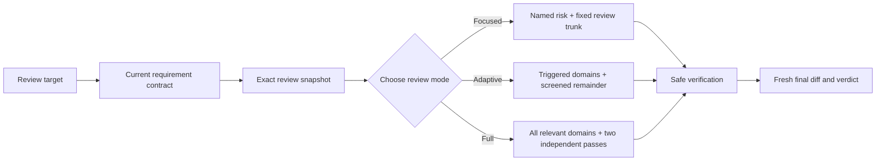

# adversarial-code-review [](docs/README.zh-CN.md)

[](https://agentskills.io/)

`adversarial-code-review` is a risk-adaptive, evidence-driven review skill for AI coding agents. It independently reviews working-tree changes, staged changes, commits, or pull requests, treating implementations, tests, descriptions, and completion claims as evidence to verify rather than facts to trust.

The skill keeps reviews read-only by default, scales depth to observable risk, and reports only defects supported by a concrete failure scenario and impact.

## Why use it?

Code review often looks thorough while leaving the highest-risk assumptions untested:

| Common approach | What goes wrong | How adversarial-code-review handles it |
| --- | --- | --- |
| Follow the original request literally | Requirements can evolve when implementation reveals new constraints | Establish the current requirement contract from the original problem and accepted changes before reviewing code |
| Review only the visible diff | Requirements, adjacent execution paths, and hidden regressions are missed | Reconstruct the requirements and trace the real production path before judging the change |
| Treat passing tests as proof | Rewritten assertions, shallow mocks, or tests aimed at the wrong layer create false confidence | Check whether each test would fail for the defect it claims to prevent |
| Apply the same checklist to every change | Small changes receive ceremony while risky changes receive shallow coverage | Select focused, adaptive, or full mode from observable scope and risk signals |
| Trust the PR description or completion report | Claims can be stale, incomplete, or unverifiable | Confirm material claims against the exact diff, repository context, and fresh command output |
| Look only for implementation bugs | Scope creep, over-engineering, weakened tests, and pseudo-regression coverage survive review | Always screen scope and test integrity, with two mandatory independent passes for large or important changes |

## Core design

- **Independent by default:** act as a skeptical senior reviewer and verify every material claim.
- **Current requirements first:** distinguish the original problem, accepted requirement changes, inferred constraints, and unapproved implementation choices before judging the diff.
- **Risk-adaptive depth:** spend review effort where the diff shows real risk instead of mechanically expanding every review.
- **Facts before conclusions:** derive the review boundary, requirements, execution paths, and verification evidence from current sources.
- **Evidence-backed findings:** require a concrete trigger, actual versus expected behavior, impact, confidence, and correction direction.
- **Read-only review:** do not edit files, mutate Git state, install dependencies, approve changes, or reply to comments unless separately authorized.
- **Fresh, auditable coverage:** record every relevant risk domain and bind the verdict to the exact final snapshot reviewed.



## Review modes

| Mode | When it applies | Depth |
| --- | --- | --- |
| **Adaptive** | Default for ordinary changes | Run the fixed review trunk, deeply inspect triggered domains, and screen the rest |
| **Full** | Comprehensive requests, large or important changes, broad architectural or contract impact, or weakened tests | Review all relevant domains and run both independent scope and test-integrity passes |
| **Focused** | The user names a specific risk domain | Deeply review that domain while retaining requirements, core logic, test credibility, adjacent regression risk, and verification coverage |

Full mode is mandatory when the change crosses the skill's observable thresholds, including at least 10 non-generated files, at least 500 effective changed lines, at least 3 affected modules or layers, or a change to a public API, database schema, dependency, or architecture boundary. Refactoring mixed with behavior changes and substantially weakened tests also trigger full mode.

## Universal scope and test checks

Every review screens both areas below. Full-mode and large or important reviews run them as separately named independent passes:

1. **Scope discipline and over-engineering** — reconstruct the required surface, challenge unrelated abstractions and infrastructure, and compare the diff with the smallest credible implementation.
2. **Test integrity and pseudo-regression protection** — reconstruct protected guarantees, inspect rewritten or deleted assertions, challenge mocks and test boundaries, and identify missing failure paths.

After an ordinary review, the skill offers these two independent passes unless they already ran, the user declined them, or the report must be non-interactive.

## Risk coverage

The review routes observable diff signals into the relevant domains:

- requirement alignment, core logic, and edge cases;
- API, dependency, command, and configuration authenticity;
- security and trust boundaries;
- data integrity, transactions, concurrency, retries, and idempotency;
- performance and resource usage;
- compatibility, migrations, deployment, observability, and rollback;
- language- and database-specific correctness checks;
- verification integrity and final-diff reinspection.

## How it works

1. Read repository instructions and identify the exact review target.
2. Establish the current requirement contract from the original problem, accepted changes, public contracts, and unresolved conflicts.
3. Record the comparison boundary and starting snapshot, then inventory the diff and classify its risk.
4. Select one review mode and route every relevant risk domain.
5. Trace requirements through real execution paths, all consumers of shared changes, and credible tests.
6. Verify existing comments without letting them limit an independent search for new blockers.
7. Run safe verification, then confirm that the final snapshot still matches the work reviewed.
8. Report a merge verdict, severity-ranked findings, verification evidence, coverage, residual risks, and a final recommendation.

## Install

Install the skill and choose a target agent:

```bash
npx skills add contrueCT/adversarial-code-review
```

Optionally install it globally for Codex and Claude Code:

```bash
npx skills add contrueCT/adversarial-code-review -g -a codex -a claude-code
```

## Use

Ask the agent to review a concrete Git boundary:

```text
Use $adversarial-code-review to independently review the current working-tree changes.
```

```text
Use $adversarial-code-review to perform a full review of this pull request against its base branch.
```

The agent can also select the skill automatically when the request matches its trigger description.

## Compatibility

The repository follows the shared [Agent Skills](https://agentskills.io/) layout. The core workflow and references are plain Markdown and can be reused by Codex, Claude Code, and other coding agents that support Agent Skills or custom instruction packages.

Codex can use [`agents/openai.yaml`](agents/openai.yaml) for UI metadata. Other agents can rely on the standard frontmatter and instructions in [`SKILL.md`](SKILL.md); support for automatic selection and manual invocation depends on the agent's own Skill integration.

## Repository structure

```text
adversarial-code-review/
├── SKILL.md
├── agents/
│   └── openai.yaml
├── references/
│   ├── language-checks.md
│   ├── review-domains.md
│   └── scope-and-test-integrity.md
├── docs/
│   └── README.zh-CN.md
└── README.md
```
