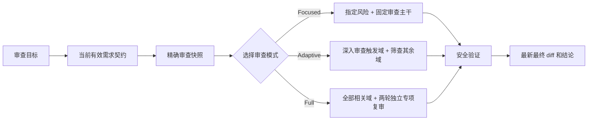

# adversarial-code-review [](../README.md)

[](https://agentskills.io/)

`adversarial-code-review` 是一个面向 AI 编程代理的风险自适应、证据驱动型代码审查 Skill。它可以独立审查工作区改动、暂存区改动、提交或拉取请求，并把实现、测试、变更说明和完成声明都视为需要验证的证据，而不是可以直接采信的事实。

这个 Skill 默认保持只读，根据可观察到的风险调整审查深度，并且只报告具有具体失败场景和明确影响的缺陷。

## 为什么使用它？

代码审查看起来可能很全面，但风险最高的假设仍然没有得到验证：

| 常见做法 | 存在的问题 | adversarial-code-review 的处理方式 |
| --- | --- | --- |
| 机械遵循最初的需求文本 | 实现过程中发现新约束时，需求可能已经合理演进 | 先从原始问题和已确认的变更中建立当前有效需求契约，再审查代码 |
| 只审查可见的 diff | 容易遗漏需求、相邻执行路径和隐藏回归 | 先还原需求并追踪真实生产路径，再判断改动是否正确 |
| 把测试通过视为充分证明 | 重写后的断言、浅层 mock 或测错层级的用例会制造虚假信心 | 检查每个测试是否真的会在其声称防止的缺陷出现时失败 |
| 对所有改动使用同一套检查清单 | 小改动承担过多流程，风险改动却可能只得到浅层检查 | 根据可观察到的范围和风险信号选择 focused、adaptive 或 full 模式 |
| 直接相信 PR 描述或完成报告 | 声明可能已经过时、不完整或无法验证 | 对照精确 diff、仓库上下文和当前命令输出验证重要声明 |
| 只查实现缺陷 | 范围膨胀、过度设计、测试弱化和伪回归验证可能绕过审查 | 始终检查范围纪律和测试完整性，大型或重要变更必须进行两轮独立专项复审 |

## 核心设计

- **默认独立审查：** 以审慎的高级审查者视角工作，验证每一项重要声明。
- **当前需求优先：** 在判断 diff 前，区分原始问题、已确认的需求变化、推断约束和未经确认的实现选择。
- **风险自适应深度：** 根据 diff 中真实存在的风险分配精力，不机械地扩大每次审查。
- **先确认事实，再给结论：** 从当前资料中确定审查边界、需求、执行路径和验证证据。
- **发现必须有证据：** 每项发现都要说明具体触发条件、实际行为与预期行为、影响、置信度和最小修正方向。
- **默认只读：** 除非另行授权，否则不编辑文件、不改变 Git 状态、不安装依赖、不批准改动，也不回复审查评论。
- **覆盖范围新鲜且可审计：** 记录每个相关风险域，并把审查结论绑定到实际检查的最终代码快照。



## 审查模式

| 模式 | 适用情况 | 审查深度 |
| --- | --- | --- |
| **Adaptive** | 普通改动的默认模式 | 执行固定审查主干，深入检查被触发的风险域，并筛查其余风险域 |
| **Full** | 用户要求全面审查，或改动规模较大、重要性较高、广泛影响架构或公共契约，或测试被弱化 | 审查全部相关风险域，并执行范围和测试完整性的两轮独立专项复审 |
| **Focused** | 用户明确指定某个风险域 | 深入检查指定风险，同时保留对需求、核心逻辑、测试可信度、相邻回归风险和验证证据的覆盖 |

当改动达到 Skill 中定义的可观察阈值时，必须使用 Full 模式。这些阈值包括：至少改动 10 个非生成文件、至少 500 行有效变更、至少影响 3 个模块或层，或者修改了公共 API、数据库模式、依赖或架构边界。重构与行为改动混合出现，以及现有测试被明显弱化时，也会触发 Full 模式。

## 通用范围与测试检查

每次审查都会筛查下面两个方面。Full 模式以及大型或重要改动会把它们作为两轮单独命名的独立专项复审来执行：

1. **范围纪律与过度设计：** 还原完成需求所必需的改动范围，质疑无关的抽象和基础设施，并将实际 diff 与最小可信实现进行比较。
2. **测试完整性与伪回归防护：** 还原原本应受保护的保证，检查被重写或删除的断言，质疑 mock 与测试边界，并识别遗漏的失败路径。

普通审查结束后，如果这两轮复审尚未执行、用户没有明确拒绝，并且报告不是非交互式输出，Skill 会主动询问是否需要继续执行。

## 风险覆盖

审查会根据 diff 中可观察到的信号，将改动路由到相关风险域：

- 需求一致性、核心逻辑和边界情况；
- API、依赖、命令和配置的真实性；
- 安全与信任边界；
- 数据完整性、事务、并发、重试和幂等性；
- 性能和资源使用；
- 兼容性、迁移、部署、可观测性和回滚；
- 特定语言和数据库的正确性检查；
- 验证完整性和最终 diff 复查。

## 工作流程

1. 阅读仓库说明并确认精确的审查目标。
2. 根据原始问题、已确认的变化、公开契约和未解决冲突建立当前有效需求契约。
3. 记录比较边界和起始快照，统计 diff 并判断风险。
4. 选择一种审查模式，并覆盖每个相关风险域。
5. 沿真实执行路径追踪需求，检查共享改动的全部消费者和可信测试。
6. 验证已有审查意见，同时独立寻找意见之外的新阻塞问题。
7. 运行安全验证，并确认最终快照仍然与已审查内容一致。
8. 输出合并结论、按严重程度排列的发现、验证证据、覆盖情况、剩余风险和最终建议。

## 安装

安装 Skill 并选择目标代理：

```bash
npx skills add contrueCT/adversarial-code-review
```

也可以为 Codex 和 Claude Code 全局安装：

```bash
npx skills add contrueCT/adversarial-code-review -g -a codex -a claude-code
```

## 使用

让代理审查一个明确的 Git 边界：

```text
Use $adversarial-code-review to independently review the current working-tree changes.
```

```text
Use $adversarial-code-review to perform a full review of this pull request against its base branch.
```

当请求符合触发条件时，代理也可以自动选择这个 Skill。

## 兼容性

这个仓库遵循通用的 [Agent Skills](https://agentskills.io/) 目录规范。核心流程和参考资料均为纯 Markdown，因此可以供 Codex、Claude Code，以及其他支持 Agent Skills 或自定义指令包的编程代理复用。

Codex 可以读取 [`agents/openai.yaml`](../agents/openai.yaml) 中的界面元数据。其他代理可以使用 [`SKILL.md`](../SKILL.md) 的标准 frontmatter 和指令；能否自动选择或手动调用 Skill，取决于具体代理提供的集成方式。

## 仓库结构

```text
adversarial-code-review/
├── SKILL.md
├── agents/
│   └── openai.yaml
├── references/
│   ├── language-checks.md
│   ├── review-domains.md
│   └── scope-and-test-integrity.md
├── docs/
│   └── README.zh-CN.md
└── README.md
```
